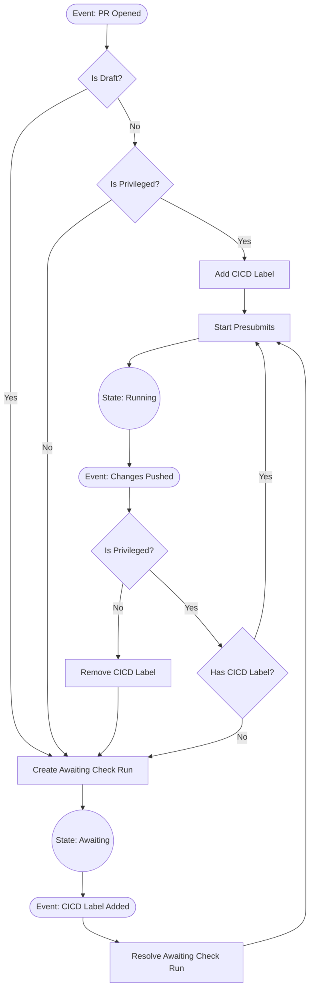

# CICD Label Flowchart

This flowchart describes the logic for managing the `CICD` label in Cocoon for running presubmit CI.

```mermaid
flowchart TD
    PR_Opened([Event: PR Opened]) --> Is_Draft{Is Draft?}

    Is_Draft -- No --> Is_Privileged_Open{Is Privileged?}
    Is_Draft -- Yes --> Create_Awaiting[Create Awaiting Check Run]

    Is_Privileged_Open -- Yes --> Add_Label[Add CICD Label]
    Add_Label --> Start_Pre[Start Presubmits]

    Is_Privileged_Open -- No --> Create_Awaiting

    Create_Awaiting --> State_Awaiting((State: Awaiting))
    Start_Pre --> State_Running((State: Running))

    State_Awaiting --> Label_Added([Event: CICD Label Added])
    Label_Added --> Resolve_Awaiting[Resolve Awaiting Check Run]
    Resolve_Awaiting --> Start_Pre

    State_Running --> Changes_Pushed([Event: Changes Pushed])
    Changes_Pushed --> Is_Privileged_Push{Is Privileged?}
    Remove_Label --> Create_Awaiting

    Is_Privileged_Push -- No --> Remove_Label[Remove CICD Label]

    Is_Privileged_Push -- Yes --> Label_Present{Has CICD Label?}
    Label_Present -- Yes --> Start_Pre
    Label_Present -- No --> Create_Awaiting
```
