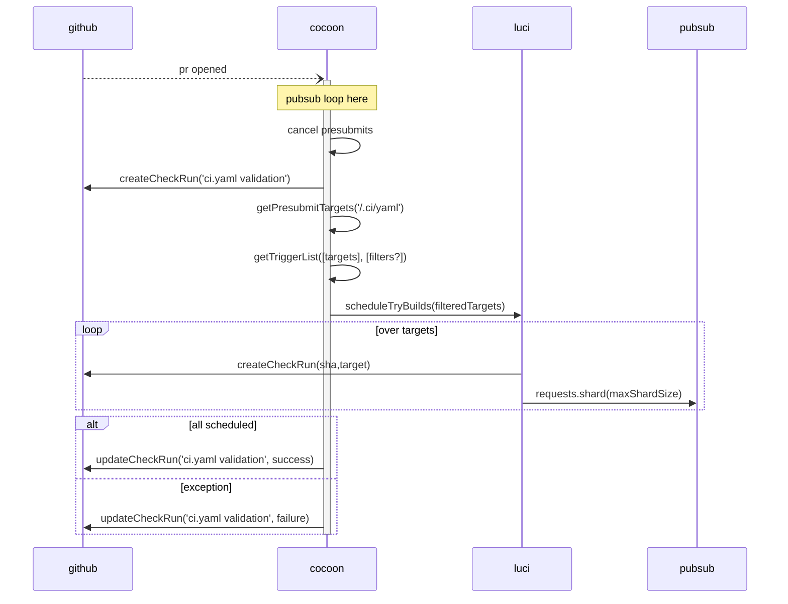
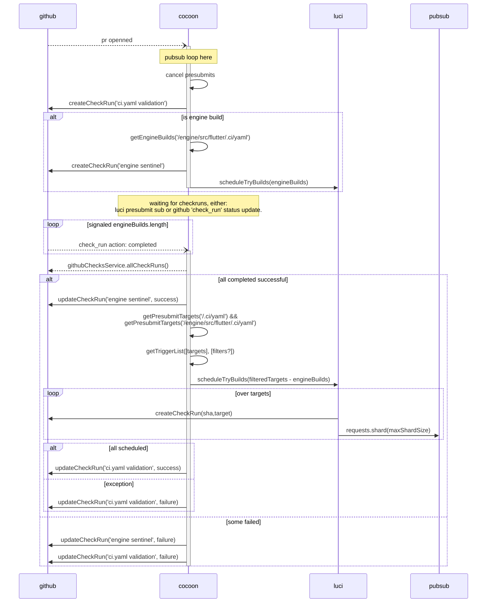

# Scheduling tasks in a Monorepo

## Presubmits

### Pre Monorepo

Before the monorepo; Cocoon scheduled task for each repository it was 'watching'
via the GitHub flutter-dashboard app. There is only one required check to pass
at this point: `ci.yaml validation`. If this validation check fails, then PR
cannot be submitted, likely signalling a failure in the `.ci.yaml` files or a
failure in the infrastructure.

What can be noted here is that anyone with commit access can bypass presubmit
checks as soon as `ci.yaml validation` completes succesfully - and before any
actual testing completes. The usage of the `autosubmit` label will wait for all
checks to pass before merging.

At a very high level, presubmits looked like:

### Monorepo Scheduling

There will be multiple `.ci.yaml` files in the repository now that the engine is
present. Pull requests can contain framework, engine, or both changes. In this
world: if any parts of the engine are changed, we need to schedule
**and wait for** and engine builds to be present to test from source. This means
either `ci.yaml validation` is kept from completing; or anotther check is
created that will block progress.

## Postsubmits

### Merge Queue

* Schedule all engine builds in the prod pool
* Wait for them to complete
* Schedule all tests
