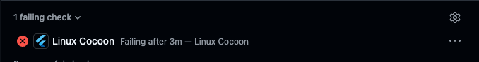
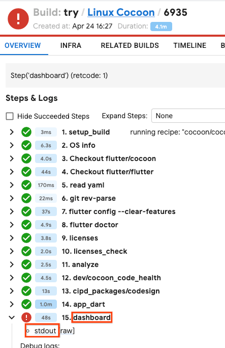

# Flutter Dashboard

For how to use the app, see the [user guide](USER_GUIDE.md)

## Set up

- Install [Flutter](https://docs.flutter.dev/get-started/install), or use an existing checkout if a Flutter developer
- (Optional) Install [Firebase CLI](https://firebase.google.com/docs/flutter/setup)

## Running locally

It is possible to run a simulation of the UI locally with fake data:

```sh
# Launches Chrome
flutter run -d chrome --web-port=8080

# Starts a web server, bring your own browser instance
flutter run -d web-server --web-port=8080
```

NOTE: Must run on port 8080[^8080] for authentication to work.

[8080]: Google employees: See [GCP > Client ID for Web App](https://console.cloud.google.com/auth/clients/308150028417-vlj9mqlm3gk1d03fb0efif1fu5nagdtt.apps.googleusercontent.com?e=-13802955&invt=AbvvHw&mods=logs_tg_prod&project=flutter-dashboard).

## Tests

Most tests can be run locally:

```sh
flutter test
```

### Updating Goldens

Some tests take and compare UI screenshots which will change over time:

```sh
flutter test --update-goldens
```

For compatibility reasons, only a Linux host is supported.

<details>

<summary>Workaround using <code>tool/update_goldens_from_luci.dart</code></summary>
As a workaround, you can download the latest images from a failing presubmit run on Cocoon's CI
which involes a few manual steps (but is way faster than getting another PC):

1. Open the failing pull request
1. Click on "Linux Cocoon" in failing checks

   

1. Find and click on `stdout` under the `dashboard` step

   

1. Run the following command with a link to the stdout URL:

   ```sh
   $ dart run tool/update_goldens_from_luci.dart "<url ending in /stdout>"

   Wrote 36825 bytes to goldens/build_dashboard.defaultPropertySheet.dark.png.
   Wrote 38556 bytes to goldens/build_dashboard.defaultPropertySheet.png.
   Wrote 24715 bytes to widgets/goldens/task_grid_test.dev.origin.png.
   ```

</details>
